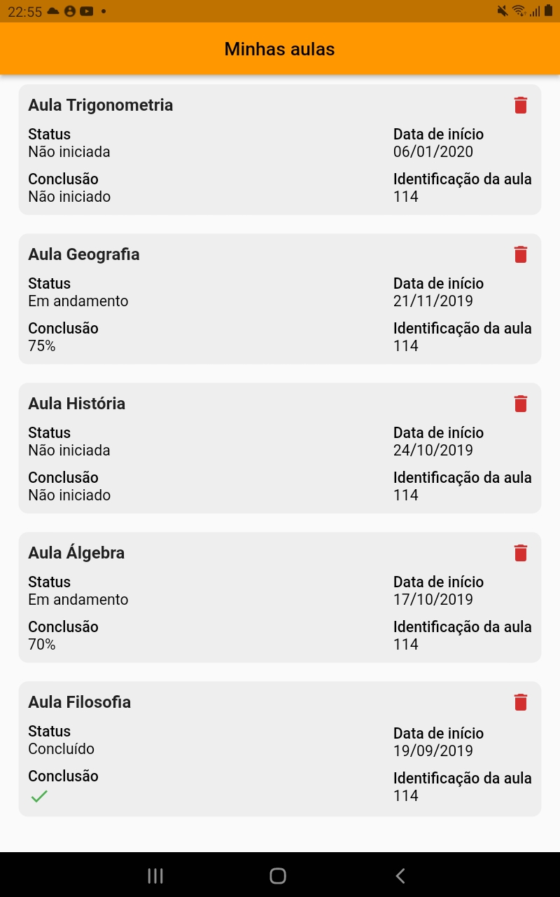
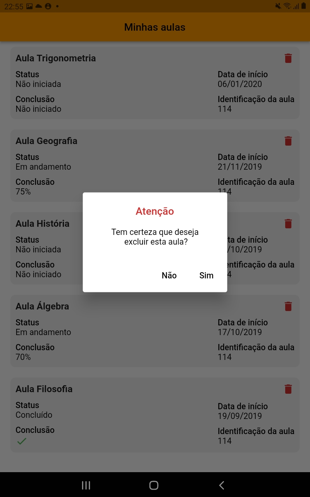

# my_classes

# Versão do flutter
 2.2.3

# Modos de rodar
Após clonar o repositório e abrir o projeto no VS Code ou Android Studio.

 - VS Code:
basta apertar a tecla F5 ou Ctrl+F5 (para rodar do modo debug).

 - Android Studio:
basta apertar a tecla Shift+F9 ou Shift+F10 (para rodar do modo debug).

 Obs: Não precisa de nenhum acesso para conseguir rodar a aplicação.

# Aplicação
Este aplicativo se trata de uma lista de aulas ordenada pela data mais recente.
Caso você queira excluir alguma aula, basta clicar no icone de lixeira e 
apertar "Sim" após aparecer a mensagem de confirmação.

# Imagens da aplicação

